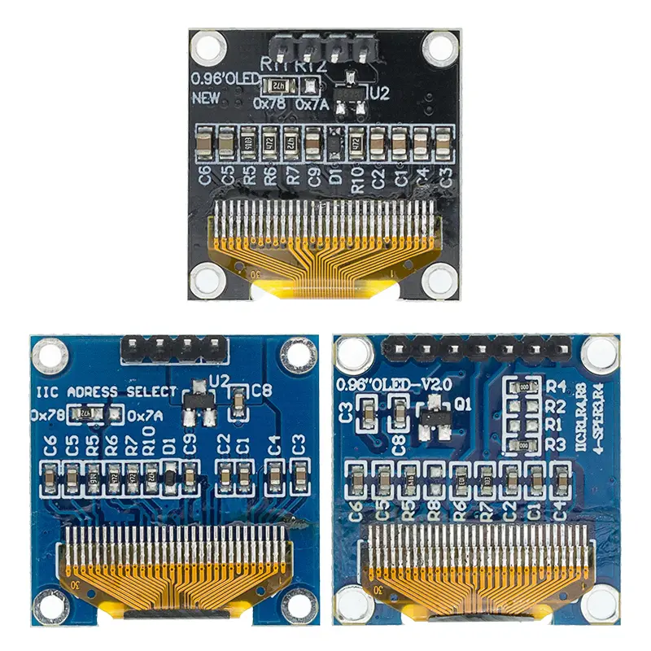

# SSD1306

Use this display with the latest libs:

- `LVGL 9.2.2 `
- `IDF 5.4.1`
- And optionally Squareline Studio

# I2C

Using latest i2c driver from IDF 5.4.1

# Working

- Rotation 0, 90, 180, 270
-- Tested 0 and 180

- Show long text
- Show short label

# Not working

- Short label is not updating